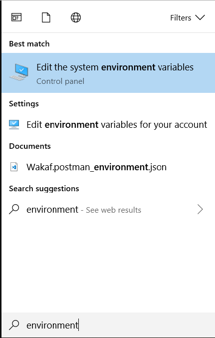

# Description
```
GIT shortcut for windows
```

# Usage
1. Clone this repository (example in this folder/disk `D:\`)

2. Open system setting environment
  
    

3. In tab `Advanced`, click `Environment Variables...` button

4. Edit `path` in `System Variables`

    

5. Paste the path of the project (example: `D:\git-shortcut-windows`)

6. Save your work and restart your active command line