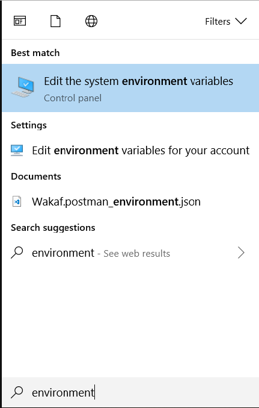
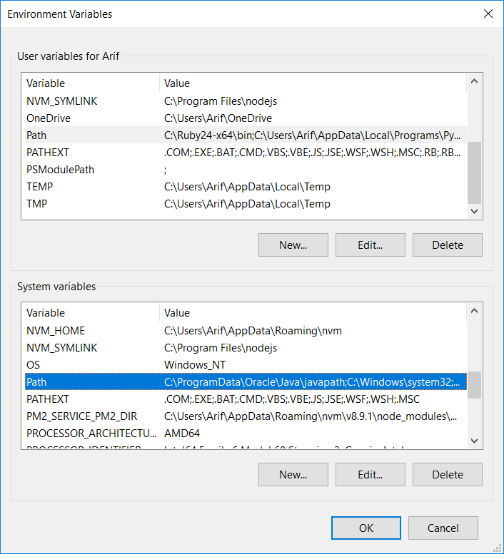

# Description
```
GIT shortcut for windows
```

# Installations
1. Clone this repository (example in this folder/disk `D:\`)

2. Open system setting environment
  
    

3. In tab `Advanced`, click `Environment Variables...` button

4. Edit `path` in `System Variables`

    

5. Paste the path of the project (example: `D:\git-shortcut-windows`)

6. Save your work and restart your active command line

# Usage
### Git status
```
# git status
gs
```

### Git commit
```
# git commit -am "update"
gc "update"

# git add . && git commit -m "add some file"
gca "add some file"
```

### Git reset
```
# Reset working stage (git reset --hard HEAD)
gr

# Reset and remove untracked files
grc
```

### Git Pull
```
# Pull from master
gpl

# Pull from another branch
gpl develop
```

### Git Push
```
# Push from master
gps

# Push from another branch
gps develop
```